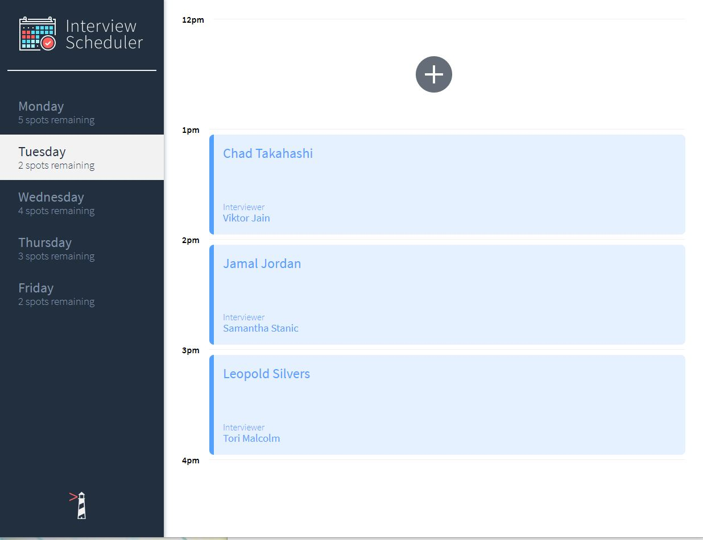
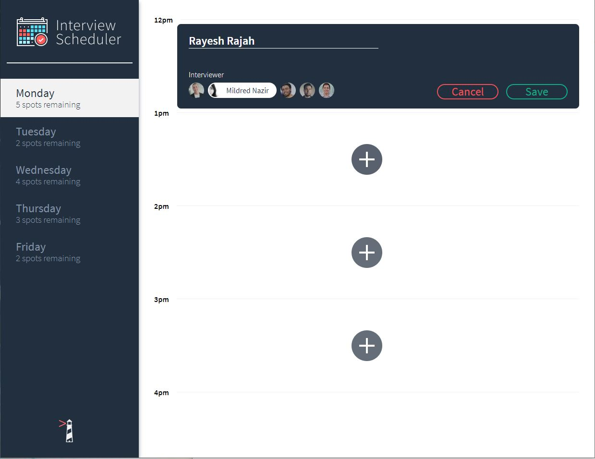
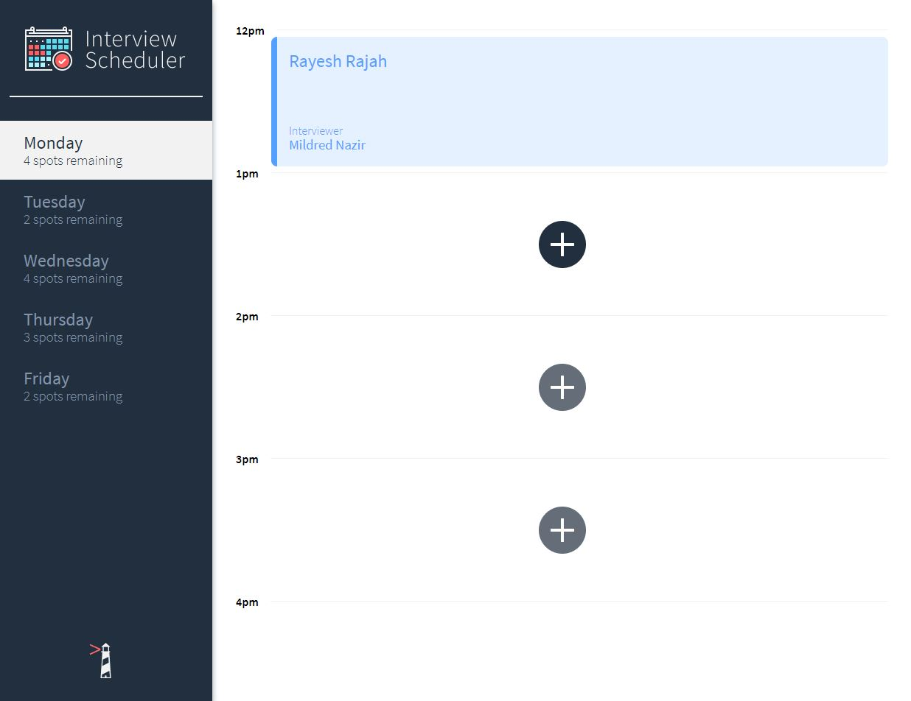
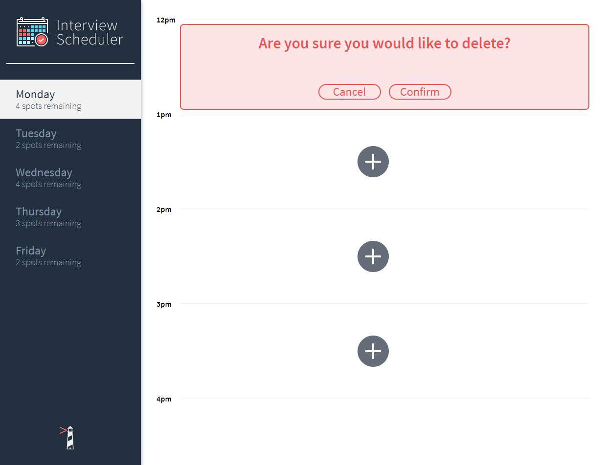
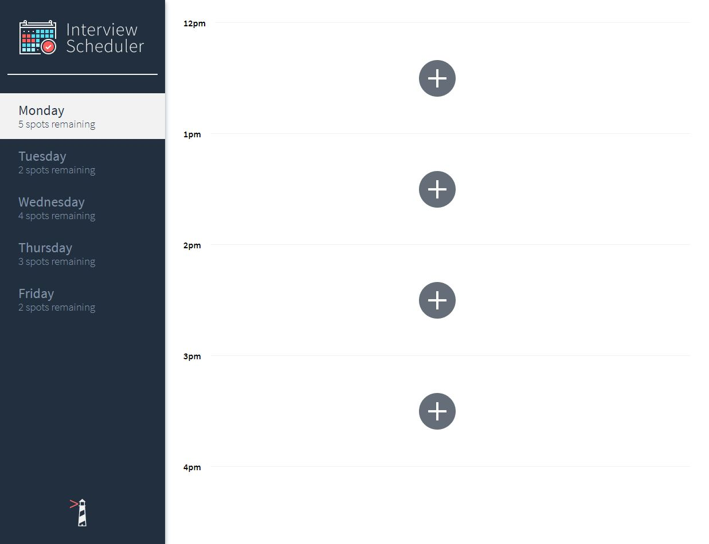

# Interview Scheduler
### About Interview Scheduler
Interview scheduler is a simple web application were an user can type his/her name and book an appointment. The user can edit or delete the interview accordingly.

### Final Product











## Setup

Install dependencies with `npm install`.

## Running Webpack Development Server

```sh
npm start
```

## Running Jest Test Framework

```sh
npm test
```

## Running Storybook Visual Testbed

```sh
npm run storybook
```
### Dependencies
- react
- axios
- classnames

### Dev-Dependcies
- storybooks
- jest testing library
- node-sass
- prop-types
- react-test render